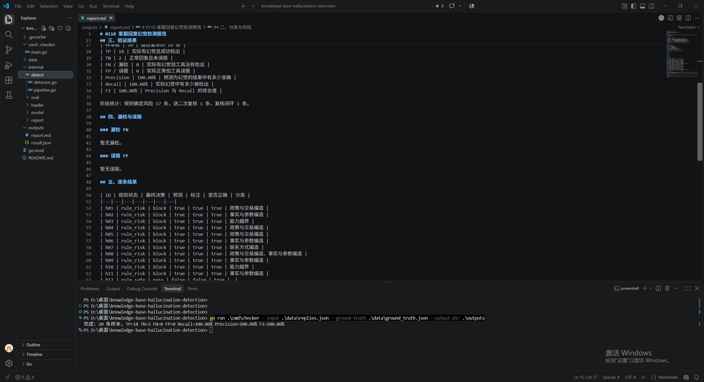

# 0110 客服回复幻觉检测
## 1. 项目边界

题目提供了 20 条历史回复和 `ground_truth.json`，因此本项目解决的是离线批量评测问题：

```text
replies.json + knowledge_base
    -> 规则初筛
    -> 规则无法确认的样本进入 LLM/人工复核边界
    -> pass / block / review
    -> 与 ground_truth 对比
    -> 输出 FN、FP 和误判分析
```

`ground_truth.json` 只能在评测阶段使用，不能参与检测，否则会发生数据泄漏。本项目不是完整的在线客服服务，也不能用 20 条样本的结果证明生产泛化能力。

## 2. 幻觉分类和风险分层

| 分类 | 严重程度 | 定义和生产动作 |
|---|---|---|
| 安全与合规误导 | P0-严重 | 健康、安全、合规场景给出危险或过度肯定结论；直接阻断并转人工。 |
| 能力越界 | P1-高 | 没有物流查询、退款查询、订单修改或工单升级能力，却声称操作已经完成；阻断或强制复核。 |
| 政策与交易编造 | P1-高 | 虚构或歪曲退货、发票、发货、快递、优惠、支付政策；阻断或强制复核。 |
| 事实与参数编造 | P2-中 | 产品参数、材质、接口、品牌关系、门店事实与知识库冲突；重新检索后改写。 |
| 联系方式编造 | P2-中 | 给出知识库禁止口头提供或无法核验的地址、电话等信息；重新核验或转人工。 |
| 关键信息遗漏 | P2-中 | 省略知识库重要限制条件，可能导致用户错误决策；进入复核或改写。 |

一条回复可以命中多个类别，严重程度取最高级别。`pass` 代表当前检测器没有发现确定性风险，不等价于“事实绝对正确”。

## 3. 检测方案：规则先筛，LLM 再复核

### 3.1 规则层

规则层负责确定性、可解释和高风险问题：

- 知识库明确写“不支持”“无”“未接入”“不具备”“需人工”，回复却给出肯定结论或声称操作完成。
- 回复中的政策、产品参数、材质、接口、快递、发货时限与知识库冲突。
- 回复给出知识库禁止直接告知的退货地址。
- 回复用绝对结论覆盖知识库中的安全提示。

规则层返回三种状态：

- `rule_risk`：规则已确认风险，最终 `block`。
- `rule_safe`：规则确认这是已知的正常表达，最终 `pass`。
- `rule_review`：规则无法确认，不擅自判定，交给复核层。

### 3.2 复核层

代码通过 `ReviewModel` 接口隔离 LLM：

```go
type ReviewModel interface {
    Review(model.Reply, model.RuleResult) model.LLMReview
}
```

当前使用 `OfflineReviewModel`，它只对本地样例中的“关键信息遗漏”做可重复的离线模拟，用来证明调用边界；它不是真实 LLM，也不读取 `ground_truth.json`。生产中这里应替换为真实 LLM，并要求结构化 JSON 输出：风险类别、证据句、置信度和理由。

为什么不让 LLM 直接负责全部判断？因为 LLM 本身也可能幻觉、受 Prompt 影响、输出不稳定。规则层兜住 P0/P1 确定性风险，LLM 处理语义、同义表达和复杂上下文，仍需置信度、超时降级和人工复核。

## 4. 运行

```powershell
cd D:\桌面\knowledge-base-hallucination-detection
go test ./...
go run .\cmd\checker --input .\data\replies.json --ground-truth .\data\ground_truth.json --output-dir .\outputs
```

默认 `--mode mock`，表示规则初筛后使用离线复核器；`--mode rule-only` 可以观察不经过复核时的规则边界。

输出：

- `outputs/result.json`：20 条逐条结果、阶段状态、最终决策、类别、理由、FN 和 FP。
- `outputs/report.md`：适合提交的文字报告。

## 5. 如何验证

只用最终预测和人工标注计算：

```text
TP：实际有幻觉，预测有幻觉
TN：实际无幻觉，预测无幻觉
FN：实际有幻觉，预测无幻觉，也就是漏检
FP：实际无幻觉，预测有幻觉，也就是误报

Precision = TP / (TP + FP)
Recall    = TP / (TP + FN)
F1        = 2 * Precision * Recall / (Precision + Recall)
```

题目最直接要求的是 FN/FP 的具体样本，不是只报一个百分比。报告会单独列出漏检和误报；Precision、Recall、F1 只是辅助性的汇总指标。

## 6. 结果应该如何解读

在这 20 条样本上得到高分，只能说明当前规则和离线复核器覆盖了这组数据，不能说明生产准确率为 100%。真实错误率需要在未参与规则设计的独立测试集上测量，并按类别、风险级别、知识库版本分别统计。

容易出错的情况：

1. 知识库只写“未标注”，这表示未知，不一定表示“不支持”；自动判错会误报。
2. 一条回复部分正确、部分错误，单一布尔标签无法表达错误片段。
3. 同义改写、复杂否定和隐含承诺难以靠规则识别，会漏检。
4. 知识库过期、缺失或与实际业务不一致时，检测器可能把错误知识当成真相。
5. LLM 复核也可能二次幻觉，因此必须要求引用证据、保留审计日志，且不能单独决定 P0 风险。

## 7. 生产演进

生产链路应是：

```text
问题识别
    -> 检索带版本和生效时间的知识库
    -> 判断是否需要调用物流/订单/退款工具
    -> 生成结构化事实声明和自然语言回复
    -> 规则校验 + 工具调用日志校验
    -> LLM 语义复核
    -> 按 P0/P1/P2 执行阻断、改写、转人工或放行
    -> 线上日志 + 人工标注 + 知识库/Prompt/模型迭代
```

还需要考虑实时延迟、LLM 成本、超时降级、权限和隐私、知识库版本、审计追踪、人工队列、线上监控以及持续标注闭环。

## 8. AI 工具使用情况

使用 Codex 辅助完成工程结构、Go 代码、测试、README 和报告模板；人工负责题目理解、分类及严重程度定义、设计“规则先筛 + 复核”的边界、审查生成代码、核对输入字段和人工标注、复核运行结果。当前不调用真实 LLM API，`OfflineReviewModel` 仅为可重复的 mock；真实接入必须增加 API 超时、重试、结构化输出校验、成本控制和失败降级。

## 9. 交付结果

在 IDE 中展示 `cmd/checker/main.go`、`internal/detect/pipeline.go`，以及终端中的 `go test ./...` 和运行命令。

运行结果：展示 `outputs/result.json` 或 `outputs/report.md` 中的阶段统计、逐条检测、漏检和误报清单。若需要浏览器截图，可将结果页作为下一步扩展；当前交付重点是可运行 CLI 和可审计报告。


